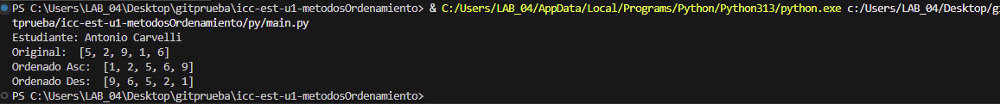
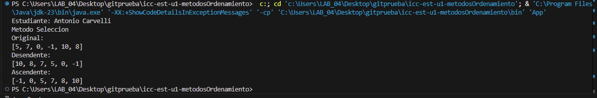
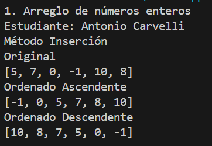
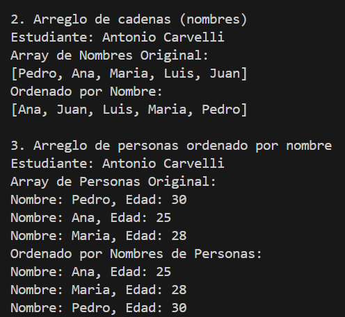
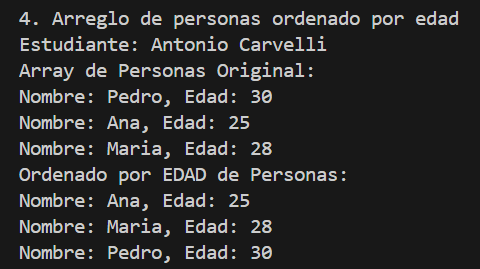

# Estructura de datos

**Estudiante:** Antonio Carvelli

## Metodos Ordenamiento

### Practica 1 - 20/OCT/2025
Metodo Sort Bubble

### Practica 2 - 21/OCT/2025
Metodo Sort Selection en Java y Python

Salida de Phyton:

Salida de Java:

### Practica 3 - 23/OCT/2025

